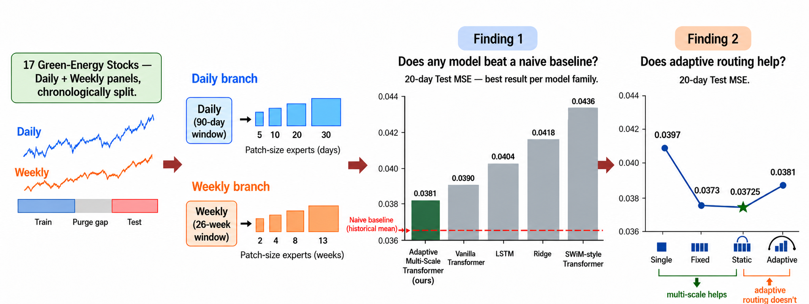

# Adaptive Multi-Scale Transformer for Green-Energy Stock Return Forecasting

Official implementation of:

**An Adaptive Multi-Scale Transformer for Green-Energy Stock Return Forecasting:  
A Controlled Evaluation of Static Scale Aggregation and Sample-Dependent Routing**

This project develops a PathFormer-inspired multi-scale Transformer for forecasting
green-energy stock returns and evaluates a central modeling question:

> Does sample-dependent scale routing add predictive value beyond a globally
> learned static mixture of temporal scales?

The empirical study uses daily OHLCV data for 17 green-energy-related equities
from Yahoo Finance and evaluates 5-, 10-, and 20-day forward return forecasts.

## Research Workflow

